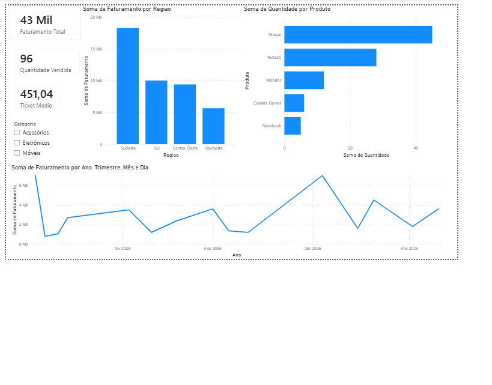

# Dashboard de Vendas com Power BI

## Objetivo

Dashboard desenvolvido para análise de vendas utilizando Power BI, permitindo acompanhar indicadores de desempenho e identificar padrões de faturamento e vendas por região e produto.

## Indicadores

- Faturamento Total
- Quantidade Vendida
- Ticket Médio

## Dataset

Base fictícia de vendas contendo:

- Data da venda
- Produto
- Categoria
- Região
- Quantidade vendida
- Valor unitário
- Faturamento
- Vendedor

## Análises Realizadas

- Faturamento por Região
- Quantidade Vendida por Produto
- Evolução das Vendas ao Longo do Tempo
- Filtro por Categoria

## Ferramentas Utilizadas

- Power BI
- Excel
- DAX

## Dashboard



## Principais Insights

- A região Sudeste apresentou o maior faturamento entre as regiões analisadas.
- O produto Mouse foi o item com maior quantidade vendida.
- Foi possível acompanhar a evolução das vendas ao longo do período analisado.
- Os filtros permitem segmentar rapidamente as informações por categoria.

## Aprendizados

Neste projeto foram aplicados conceitos de:

- Modelagem de dados
- Criação de medidas DAX
- Desenvolvimento de KPIs
- Construção de dashboards interativos
- Visualização de dados para apoio à tomada de decisão

## Estrutura do Projeto

```
dashboard-vendas-powerbi
│
├── dashboard.pbix
├── vendas.xlsx
├── README.md
└── imagens
    └── dashboard.png
```

## Autor

Giovanna Gomes
